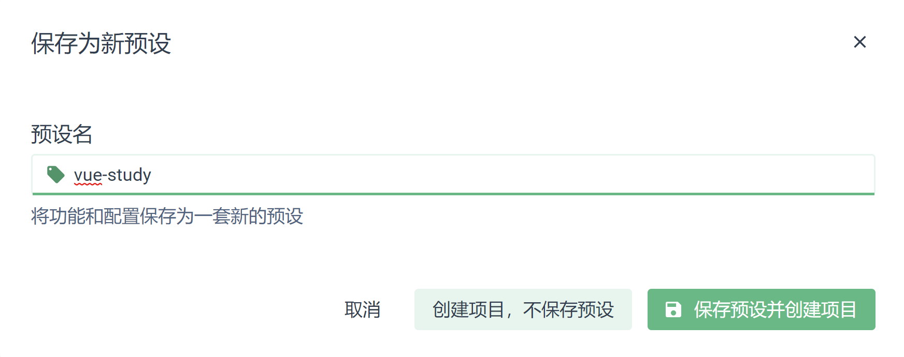

Vue-cli 4

Vue-cli项目搭建

安装nodejs
----------

参考安装配置：

<https://www.runoob.com/nodejs/nodejs-install-setup.html>

安装vue-cli
-----------

参考安装配置

<https://cli.vuejs.org/zh/guide/installation.html>

启动vue ui创建项目
------------------

C:\\Users\\廖尹祯\>vue ui

在浏览器中创建项目

手动配置项目

选择router，vuex，css ，linter，使用单个配置文件

添加Sass，ESlint自动检查

保存项目预设，下次可以直接创建好

创建项目

项目创建完毕

Vscode 打开Vue-study

项目目录：

Public 公共

├─assets 常量

├─components 组件

├─router 路由

├─store vuex状态

└─views 页面

Npm install 安装项目依赖

修改package.json中Serve为dev

Npm run dev启动项目

添加vue.config.js 配置文件

新增导出对象：

  runtimeCompiler: true,

    publicPath:'',

    devServer: {

        host: '0.0.0.0',

        port: '80',

    }

配置运行时编译

公共路径

服务配置：主机，端口
