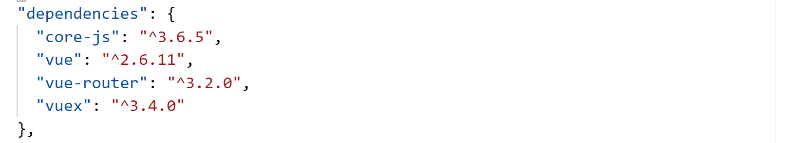
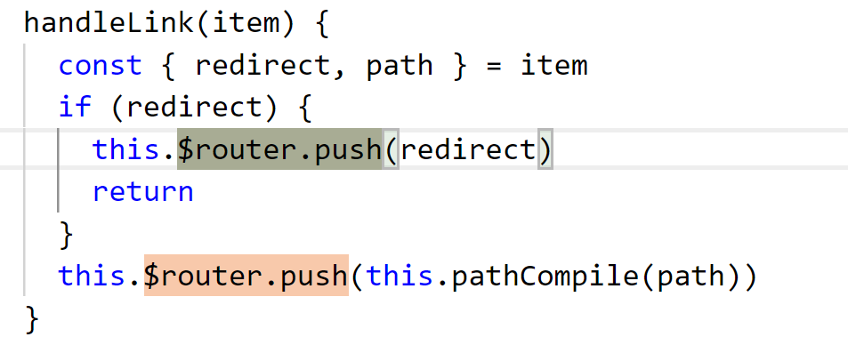

Vue-router整合

安装vue-router插件依赖
----------------------

在vue ui中选中项目安装vue-router插件

安装成功后查看package.json中存在依赖项vue-router

或者直接运行命令

npm install vue-router

新增router文件
--------------

在src下新建router文件夹，添加index.js文件

导入vue及vue-router

import Vue from 'vue'

import VueRouter from 'vue-router'

模块化工程使用use对vue-router进行引用

Vue.use(VueRouter)

创建VueRouter对象并导出

const router = new VueRouter({

  routes

})

export default router

Main.js中全局调用router
-----------------------

导入在router/index.js中导出的router对象

import router from './router'

创建vue时引入全局router

New vue中的router中mount至id为app的组件

在app.vue中引用\<router-view/\>

动态路由匹配
------------

在views中新建redirect.vue配置

导出create方法和render方法

在router/index.js中匹配path为参数，实现动态重定向

### Router中基本规则参数

{

    path: '/redirect',

    component: Layout,

    hidden: true,

    children: [

      {

        path: '/redirect/:path(.\*)',

        component: (resolve) =\> require(['\@/views/redirect'], resolve)

      }

    ]

  }

Path：拦截匹配路径

Component：引用组件

Children：嵌套路由

路由懒加载：

(resolve) =\> require(['\@/views/login'], resolve),

### 动态路径使用

// 动态路径参数 以冒号开头

'/redirect/:path(.\*)'

可以在一个路由中设置多段“路径参数”，对应的值都会设置到 \$route.params 中。例如：

| **模式**                      | **匹配路径**        | **\$route.params**                   |
|-------------------------------|---------------------|--------------------------------------|
| /user/:username               | /user/evan          | { username: 'evan' }                 |
| /user/:username/post/:post_id | /user/evan/post/123 | { username: 'evan', post_id: '123' } |

### 实例应用

#### 在面包屑中引用动态路由

// 给出一个路由 { path: '/user-\*' }

this.\$router.push('/user-admin')

this.\$route.params.pathMatch // 'admin'

#### 监测路由变化

#### 高级正则表达式匹配

可参考案例

<https://github.com/vuejs/vue-router/blob/dev/examples/route-matching/app.js>

同一路径匹配优先级

同一个路径可以匹配多个路由，此时，匹配的优先级就按照路由的定义顺序：谁先定义的，谁的优先级就最高。

嵌套路由匹配
------------

Children为嵌套路由标志

上图的匹配规则为/user/profile

Redirect为重定向，直接访问/user会重定向至/noredirect

在app中的为最上层视图

\

\<router-view\>\</router-view\>

\</div\>

在children中也可以在模板添加一个 \<router-view\>

在layout中引用app-main组件

App-main组件中router-view 展示参数路由组件

Layout嵌套路由类似参考

<https://router.vuejs.org/zh/guide/essentials/named-views.html#%E5%B5%8C%E5%A5%97%E5%91%BD%E5%90%8D%E8%A7%86%E5%9B%BE>

transition：为路由添加过度动效

路由相关方法
------------

Router和this,\$router类似

router.push(location, onComplete?, onAbort?)

| **声明式**                | **编程式**       |
|---------------------------|------------------|
| \<router-link :to="..."\> | router.push(...) |

会往history中添加记录

router.replace(location, onComplete?, onAbort?)

| **声明式**                        | **编程式**          |
|-----------------------------------|---------------------|
| \<router-link :to="..." replace\> | router.replace(...) |

不会添加记录

router.go(n)

这个方法的参数是一个整数，意思是在 history 记录中向前或者后退多少步

History模式、页面滚动使用
-------------------------

在router/index.js中添加

### History模式

mode: 'history', // 去掉url中的\#  hash

使用时注意nginx配置

### 页面滚动

scrollBehavior: () =\> ({ y: 0 }),

scrollBehavior (to, from, savedPosition) {

// return 期望滚动到哪个的位置

}

这个方法返回滚动位置的对象信息，长这样：

{ x: number, y: number }

{ selector: string, offset? : { x: number, y: number }} (offset 只在 2.6.0+
支持)

如果返回一个 falsy (译者注：falsy 不是
false，参考这里)的值，或者是一个空对象，那么不会发生滚动。

路由权限过滤
------------

在src下新建permission.js 进行路由拦截过滤

使用router.beforeEach 注册一个全局前置守卫

相关参数解释：

用于拦截判断用户是否登录，是否获取token

注册全局后置钩子

在路由加载完毕后，关闭滚动读条

补充：

vue-router
提供的导航守卫主要用来通过跳转或取消的方式守卫导航。有多种机会植入路由导航过程中：全局的,
单个路由独享的, 或者组件级的。

记住参数或查询的改变并不会触发进入/离开的导航守卫

Router其他相关可查看官网
------------------------

<https://router.vuejs.org/zh/guide/>
