Vue-Vuex整合

安装vuex插件依赖
----------------

在vue ui中安装vuex依赖

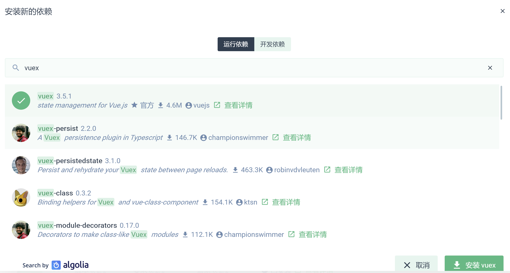

安装成功后查看package.json中存在依赖项vuex

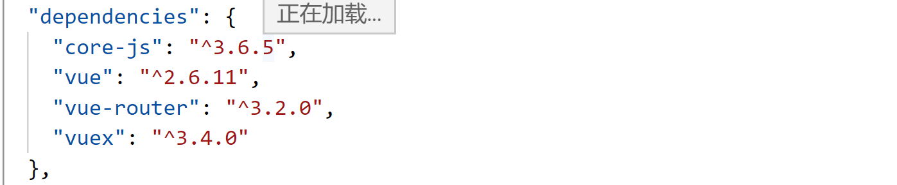

或者直接运行命令

npm install vuex --save

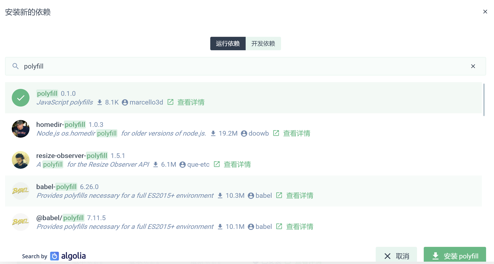

为支持低版本的浏览器，可以添加依赖polyfill

新增vuex文件
------------

在src下新建store文件夹，添加index.js文件

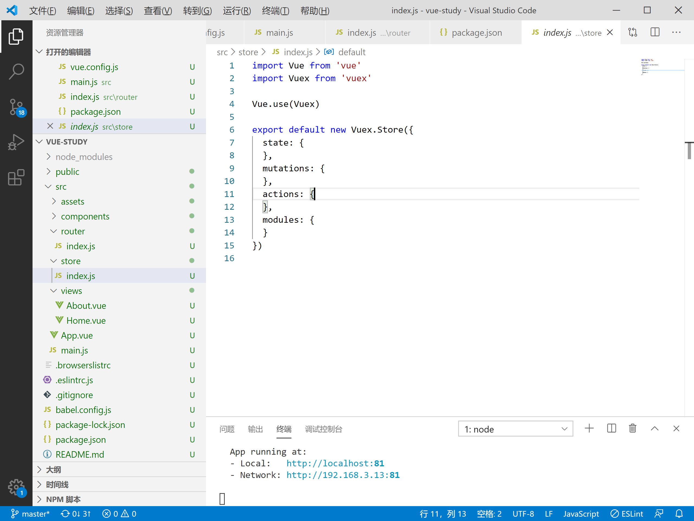

导入vue及vuex

import Vue from 'vue'

import Vuex from 'vuex'

模块化工程使用use对vux进行引用

Vue.use(Vuex)

创建Store对象并导出

export default new Vuex.Store({

  state: {

  },

  mutations: {

  },

  actions: {

  },

  modules: {

  }

})

Main.js中全局调用vuex
---------------------

导入在router/index.js中导出的router对象

import store from './store'

创建vue时引入全局store

New vue中的store中mount至id为app的组件

每一个 Vuex 应用的核心就是
store（仓库）。“store”基本上就是一个容器，它包含着你的应用中大部分的状态
(state)。Vuex 和单纯的全局对象有以下两点不同：

Vuex 的状态存储是响应式的。当 Vue 组件从 store 中读取状态的时候，若 store
中的状态发生变化，那么相应的组件也会相应地得到高效更新。

你不能直接改变 store 中的状态。改变 store 中的状态的唯一途径就是显式地提交
(commit)
mutation。这样使得我们可以方便地跟踪每一个状态的变化，从而让我们能够实现一些工具帮助我们更好地了解我们的应用。每一个
Vuex 应用的核心就是
store（仓库）。“store”基本上就是一个容器，它包含着应用中大部分的**状态
(state)**。Vuex 和单纯的全局对象有以下两点不同：

1.  Vuex 的状态存储是响应式的。当 Vue 组件从 store 中读取状态的时候，若 store
    中的状态发生变化，那么相应的组件也会相应地得到高效更新。

2.  你不能直接改变 store 中的状态。改变 store 中的状态的唯一途径就是显式地**提交
    (commit)
    mutation**。这样使得我们可以方便地跟踪每一个状态的变化，从而让我们能够实现一些工具帮助我们更好地了解我们的应用。

Store管理
---------

在/store/index.js文件中添加需要进行状态管理的模块

Getters为所有store state的获取对象统一处理

其他每个模块分别单独处理

state,

mutations,

actions

### modules分割

index,js处理所有modules

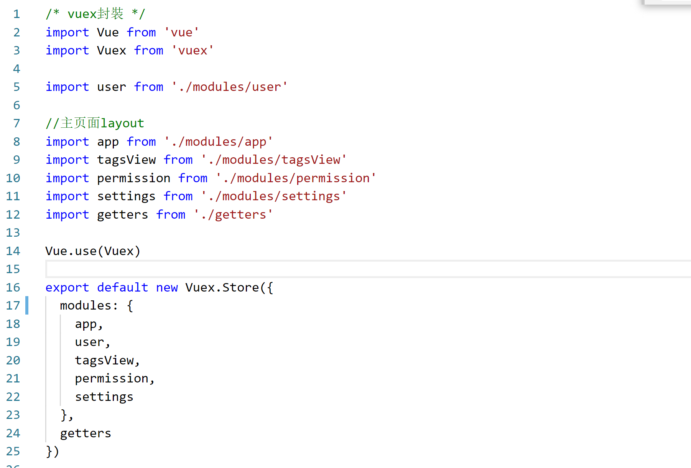

App注册为带命名空间的模块

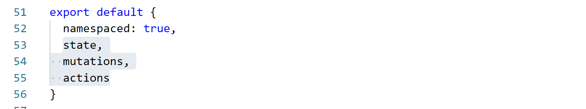

### State调用

在user.js中注册user相关的state

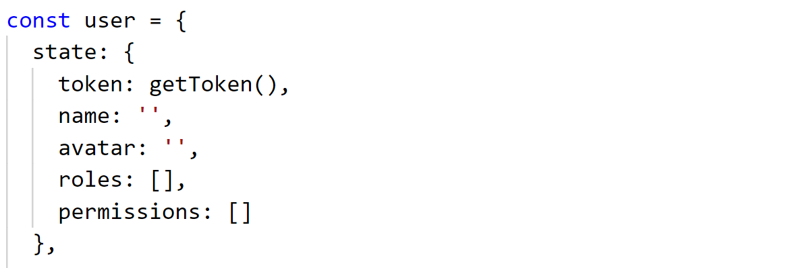

组件需要获取多个状态的时候可以使用mapstate辅助函数

在setting,js中定义页面相关的显示信息

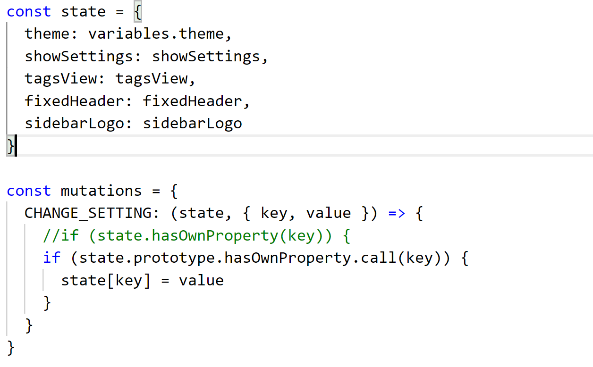

在layout/index.vue中获取settings中的state

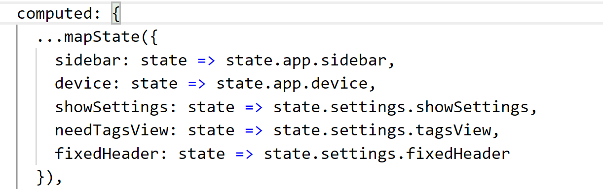

### Getters调用

在getters.js中注册getters 并导出为对象

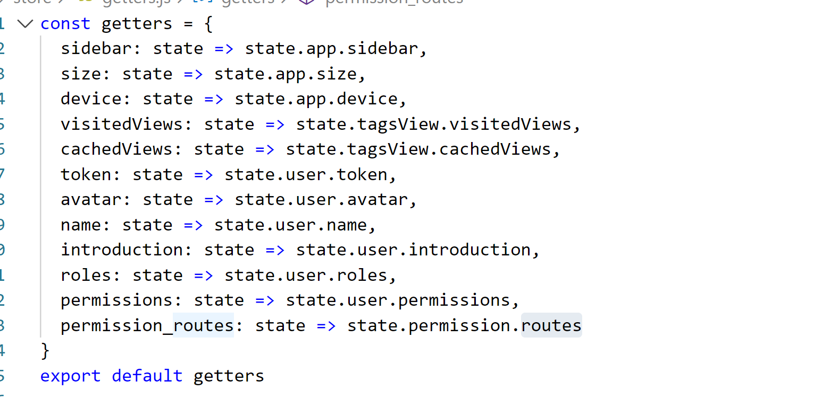

Getter会暴露为store.getters对象

通过属性，获取单个getters信息

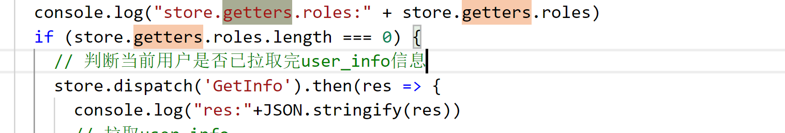

获取多个getters中的信息

需要使用mapGetters 来实现

导入mapGetters 

import { mapGetters } from 'vuex'

计算属性中引入

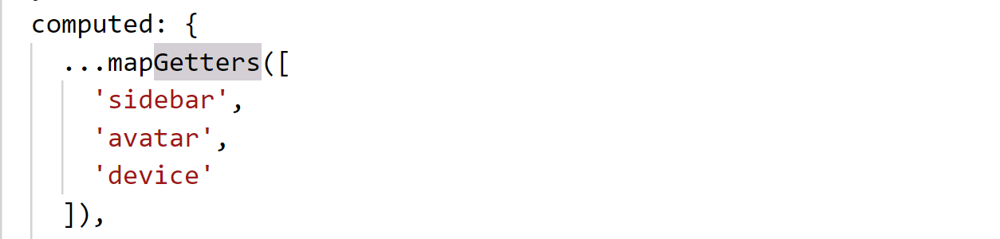

### Mutations调用

更改 Vuex 的 store 中的状态的唯一方法是提交 mutation

在user.js中定义mutation

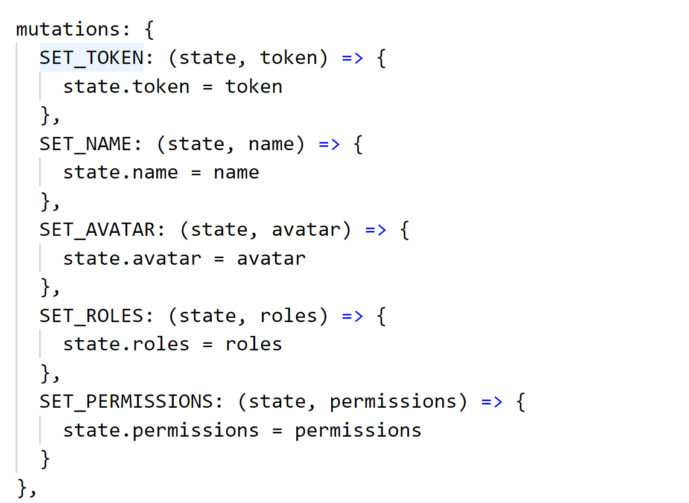

调用 commit方法，更新状态

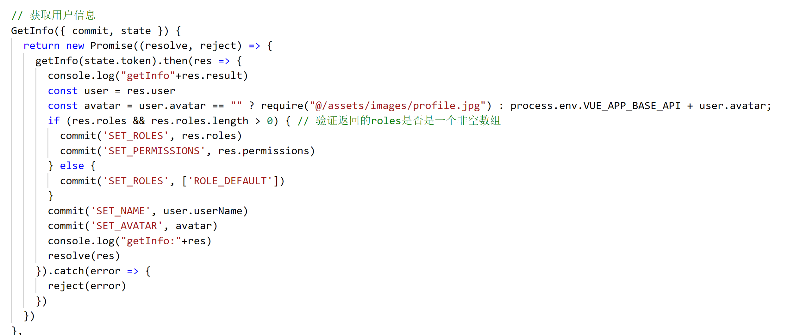

commit('SET_ROLES', res.roles)

第一个参数为定义的mutation，第二个参数为变化值res.roles

### Action调用

在user.js中注册action Login

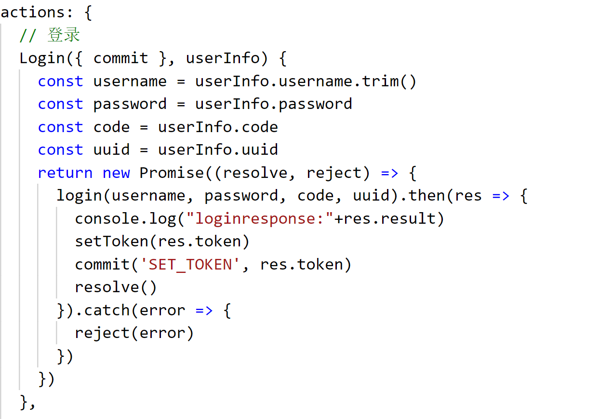

Action 提交的是 mutation，而不是直接变更状态。

Action 可以包含任意异步操作。

Action返回为Promise对象，resolve成功，reject失败

在登录组件中使用 this.\$store.dispatch('xxx') 分发action

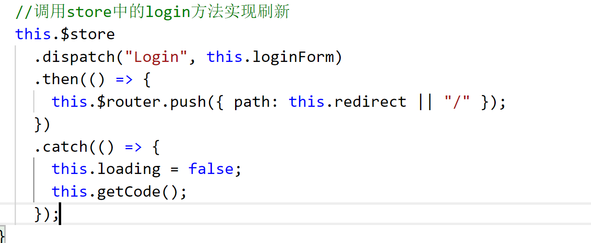

成功返回则跳转登录

失败返回抓取异常，获取错误码

Vuex其他相关可以查看官网
------------------------

Vuex官网地址

<https://vuex.vuejs.org/zh/guide/>

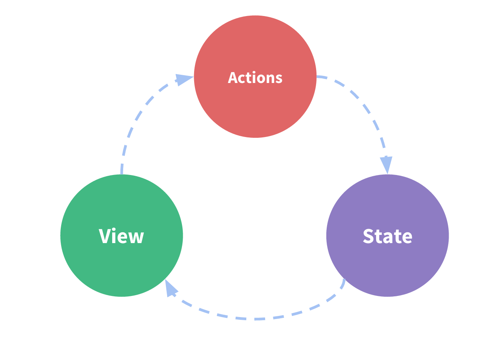

-   **state**，驱动应用的数据源；

-   **view**，以声明方式将 **state** 映射到视图；

-   **actions**，响应在 **view** 上的用户输入导致的状态变化。

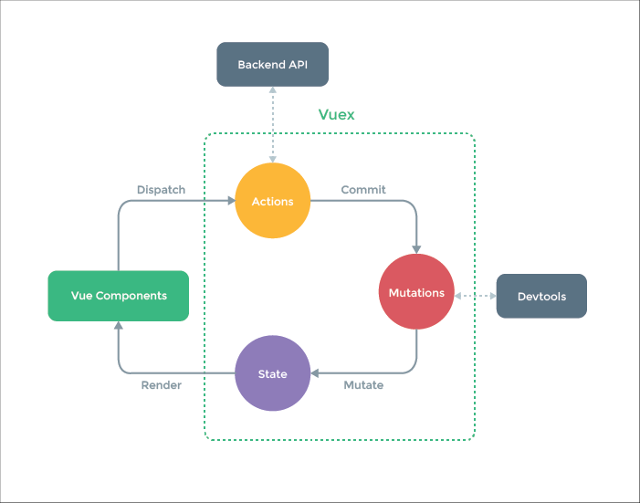
