Vue-axios整合

安装vue-axios插件依赖
---------------------

在vue ui中选中项目安装axios插件

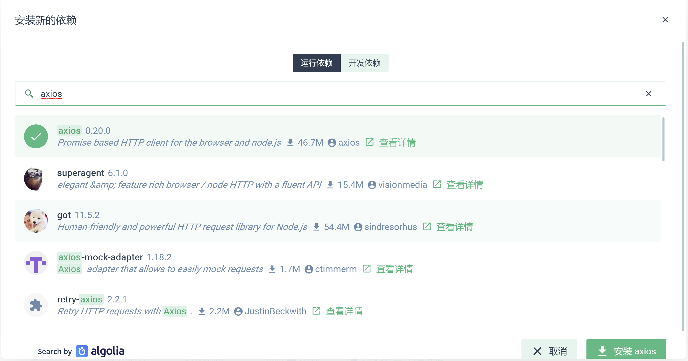

安装成功后查看package.json中存在依赖项axios

同样操作添加vue-axios依赖

或者直接运行命令

npm install axios vue-axios

Main.js中全局使用axios
----------------------

import axios from 'axios'

import VueAxios from 'vue-axios'

//使用vue-axios 插件

Vue.use(VueAxios, axios)

即可使用this.axios.get/ this.axios.post来发送请求数据

Axios封装使用
-------------

在src下新建utils文件夹，添加request.js文件

导入'axios'

import axios from 'axios'

通过axios.defaults设置全局默认值，在所有请求中都生效axios.defaults.headers['Content-Type'] = 'application/json;charset=utf-8'

创建axios实例，自定义实例的默认值，以及修改实例的配置

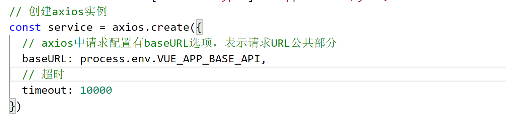

也可以在每个请求中修改配置

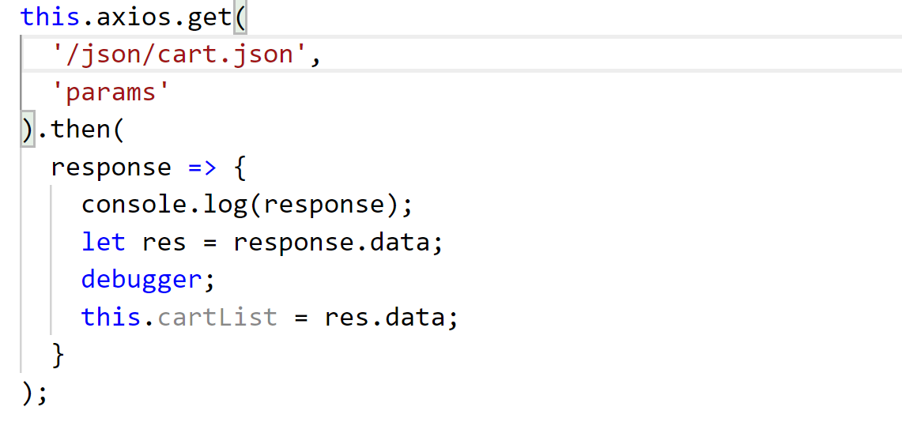

以上配置方法优先级从上往下依次增高，更多配置可参考下列参数

{

method：'请求方法',

baseURL：'如果路径不是绝对路径，就会在路径前自动添加此路径',

transformRequest: [(data, header)=\>{}],
//在发送请求之前修改数据，适用于post、put、patch

transformResponse: [(data)=\>{

return JSON.parse(data).data;

}], //在收到的数据传到then之前修改数据，注意这里data是个字符串类型。

header: {'X-Requested-With': 'XMLHttpRequest'}, //请求头

params: {}, //请求参数

paramsSerializer: (params)=\>{

return qs.stringify(params); //name=xiaohong&id=1

} //可选函数，可以把参数拼接成字符串

data: {}, // post类方法的请求体参数

timeout: 0, //请求延时事件，如果超时请求终止

withCredentials: false, //是否时跨站点请求

onUploadProgress: (progressEvent)=\>{

//可以通过progressEvent拿到上传的进度

},

onDownloadProgress: ()=\>{},//和onUploadProgress一样，获取下载的进度

responseType: json, // 返回的数据格式

maxContentLength: 2000, //相应内容的最大尺寸

validateStatus: (validateStatus)=\>{

return validateStatus \>= 200; //限制相应状态码，如果不满足就拒绝

},

cancelToken: new cancelToken(function(cancel){}) //
指定一个取消请求标识，下面会用到

}

### 请求拦截器

请求拦截器为在发送请求前的处理，一般用来修改指定参数，或者判断权限添加相关特殊处理

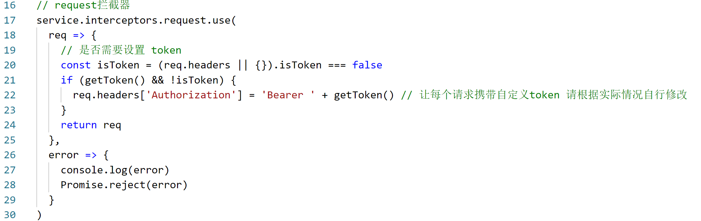

### 响应拦截器

响应拦截器为方法处理then()中内容之前调用，一般用来判断后台返回响应码处理。

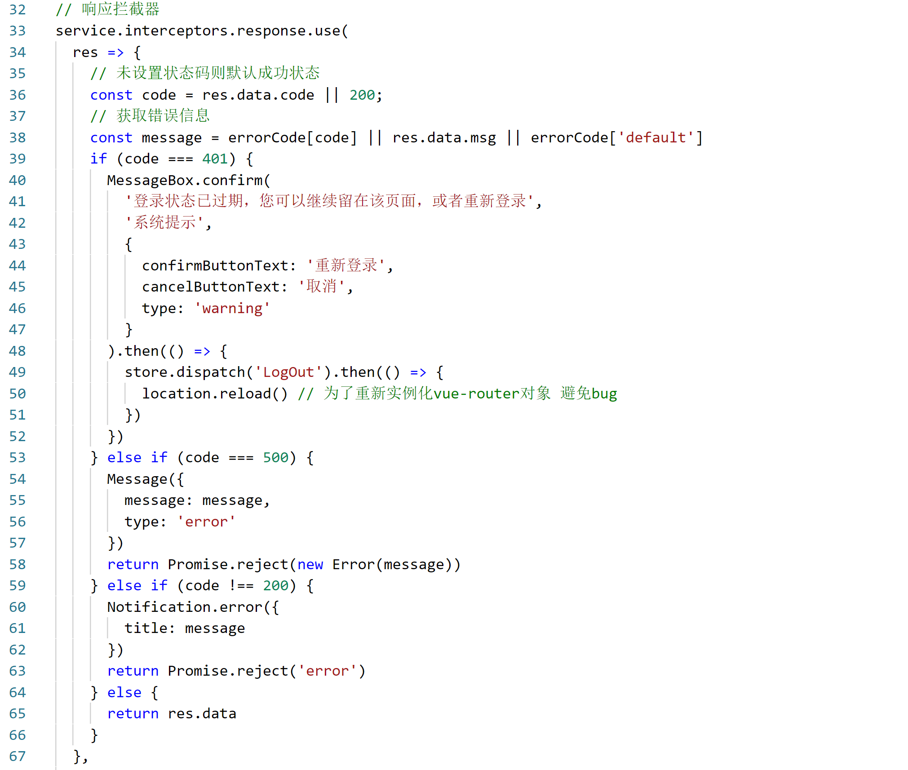

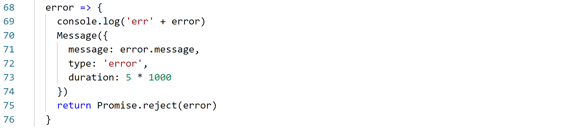

### 请求调用

在src下新建api文件夹

#### 新建api.js供简单请求调用

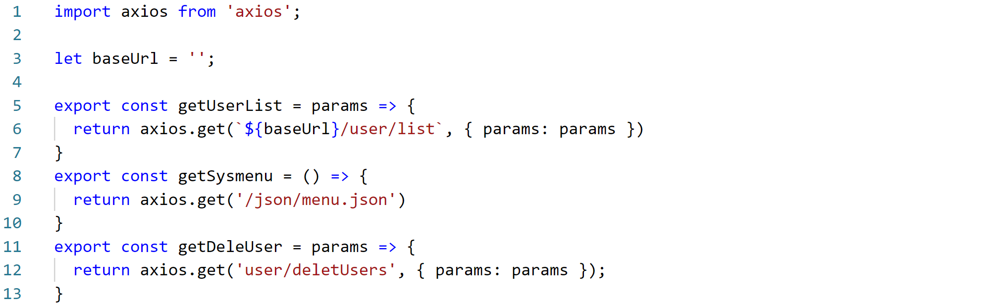

直接使用axios对象进行简单的get或post请求操作

#### 新建模块化统一api进行调用

每个模块api对应一个js，如登录模块对应login.js

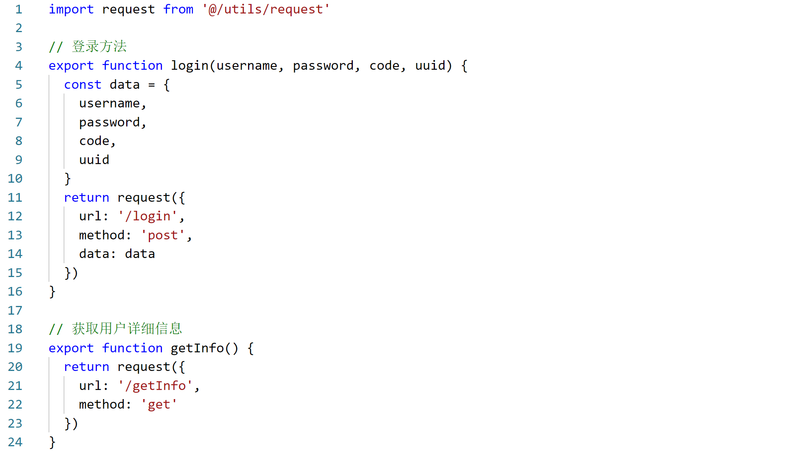

1.  引入封装好的request.js

2.  暴露封装的方法供vue调用

3.  Vue引入api并调用

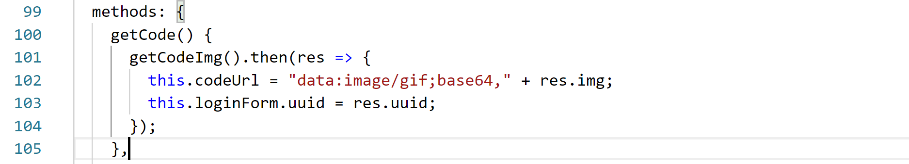

1.  或在store的Action中调用

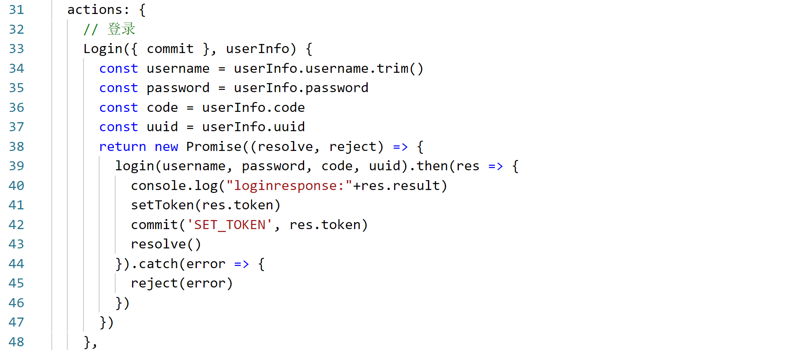

### 跨域问题解决

在vue.config.js中添加proxy代理

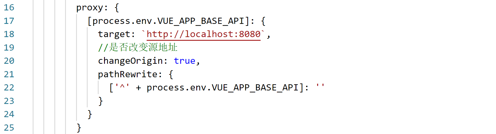

process.env.VUE_APP_BASE_API 为自带参数变量

target 为请求地址

changeOrigin 为是否改变源地址

Axios特性
---------

Axios 是一个基于 promise 的 HTTP 库，可以用在浏览器和 node.js 中。

-   从浏览器中创建 *XMLHttpRequests*

-   从 node.js 创建 [http](http://nodejs.org/api/http.html) 请求

-   支持 [Promise](https://developer.mozilla.org/en-US/docs/Web/JavaScript/Reference/Global_Objects/Promise) API

-   拦截请求和响应

-   转换请求数据和响应数据

-   取消请求

-   自动转换 JSON 数据

-   客户端支持防御 [XSRF](http://en.wikipedia.org/wiki/Cross-site_request_forgery)

Axios其他相关可查看官网
-----------------------

<http://www.axios-js.com/docs>
