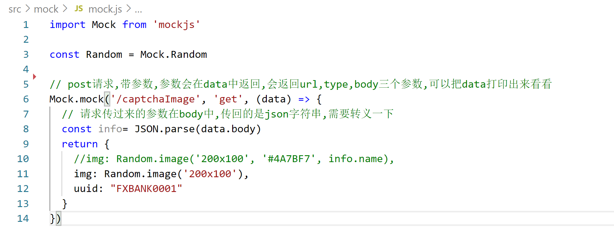

Vue-mockjs整合

Mock选择
--------

1.我们可以使用json文件来模拟后台数据，但比较局限，无法模拟数据的增删改查

2.使用json-server模拟，但不能随机生成所需数据

3.使用mockjs模拟后端接口，可随机生成所需数据，可模拟对数据的增删改查

### 优点

1.前后端分离，

2.可随机生成大量的数据

3.用法简单

4.数据类型丰富

5.可扩展数据类型

6.在已有接口文档的情况下，我们可以直接按照接口文档来开发，将相应的字段写好，在接口完成
之后，只需要改变url地址即可。

安装mockjs插件依赖
------------------

在vue ui中选中项目安装mockjs插件

安装成功后查看package.json中存在依赖项mockjs

或者直接运行命令

npm install mockjs

mockjs封装
----------

在src下新建mock文件夹，新建mock.js文件

导入mockjs

Mock.mock('/captchaImage', 'get', (data) =\> {

  // 请求传过来的参数在body中,传回的是json字符串,需要转义一下

  const info= JSON.parse(data.body)

  return {

    //img: Random.image('200x100', '\#4A7BF7', info.name),

    img: Random.image('200x100'),

    uuid: "FXBANK0001"

  }

})

Mock.mock( rurl, rtype, function( options ) )

rurl与api请求url一致，rtype为请求方式，function( options )执行结果会返回

记录用于生成响应数据的函数。当拦截到匹配 rurl 和 rtype 的 Ajax 请求时，函数
function(options) 将被执行，并把执行结果作为响应数据返回。

Data为前端传入的参数对象，return的json为返回的数据，json可再次封装

挡板json数据的集中

在mock文件夹中新建json来存放各接口返回的json数据

为分离数据及方法，将返回数据json分离

用require方法直接请求json数据

Main.js中全局使用mock
---------------------

//mock测试引入

import './mock/mock.js'

所有请求将被拦截发送至mock处理

Mockjs其他语法说明
------------------

### **Mock.Random**

Mock.Random是一个工具类，用于生成各种随机数据。

Mock.Random 的方法在数据模板中称为『占位符』，书写格式为 \@占位符(参数 [, 参数])

实例：

// 引入 Mock

var Mock = require('mockjs')

// 定义数据类型

var data = Mock.mock({

// 20条数据

"data\|3": [{

// 商品种类

"goodsClass": "女装",

// 商品Id

"goodsId\|+1": 1,

//商品名称

"goodsName": "\@ctitle(10)",

//商品地址

"goodsAddress": "\@county(true)",

//商品等级评价★

"goodsStar\|1-5": "★",

//商品图片

"goodsImg": "\@Image('100x100','\@color','小甜甜')",

//商品售价

"goodsSale\|30-500": 30,

// 邮箱：

"email": "\@email",

// 颜色

"color": "\@color",

// name

"name": "\@name",

//img,参数1：背景色，参2：前景色，参3：图片的格式，默认png，参4：图片上的文字

"img": "\@image('100\*100','\@color')",

//英文文本(句子)参1：句子的个数，参2：句子的最小个数
参3：句子的最大个数，没有参1时，参2参3才会生效

"Etext":"\@paragraph(1,1,3)",

//中文文本(句子)参1：句子的个数，参2：句子的最小个数
参3：句子的最大个数，没有参1时，参2参3才会生效

"Ctext":"\@cparagraph(1,1,3)",

//中国大区

"cregion":"\@region",

// 省

"cprovince":"\@province",

//市

"ccity":"\@city",

//省 + 市

"ss":"\@city(true)",

//县

"country":"\@county",

//省市县

"countrysx":"\@county(true)",

//邮政编码

"code":"\@zip"

}]

})

// 输出结果

// console.log(data);

Mockjs其他相关可查看官网
------------------------

<https://github.com/nuysoft/Mock/wiki/Getting-Started>
