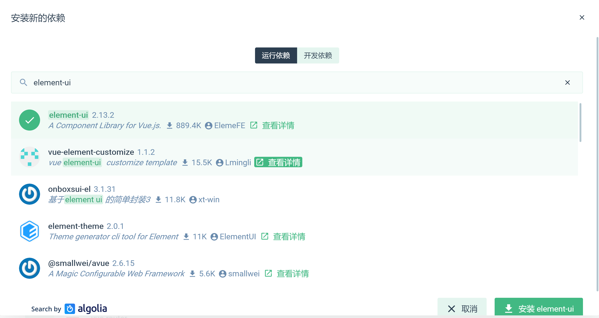
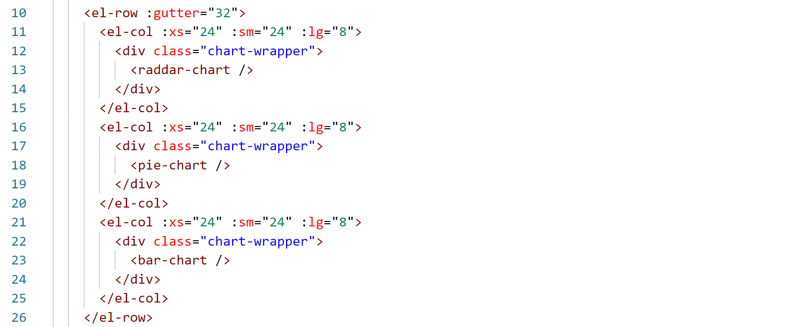

Vue-element-ui整合

安装element-ui插件依赖
----------------------

在vue ui中选中项目安装element-ui插件

安装成功后查看package.json中存在依赖项element-ui

或者直接运行命令

npm install element-ui

Main.js中全局注册element-ui
---------------------------

//element-ui

import ElementUI from 'element-ui'

//import 'element-ui/lib/theme-chalk/index.css'

import './assets/styles/element-variables.scss'

引入element-ui 及element-ui样式

页面使用element-ui
------------------

页面中采用统一的element-ui标签样式

Element-ui其他相关可查看官网
----------------------------

<https://element.eleme.cn/#/zh-CN>
