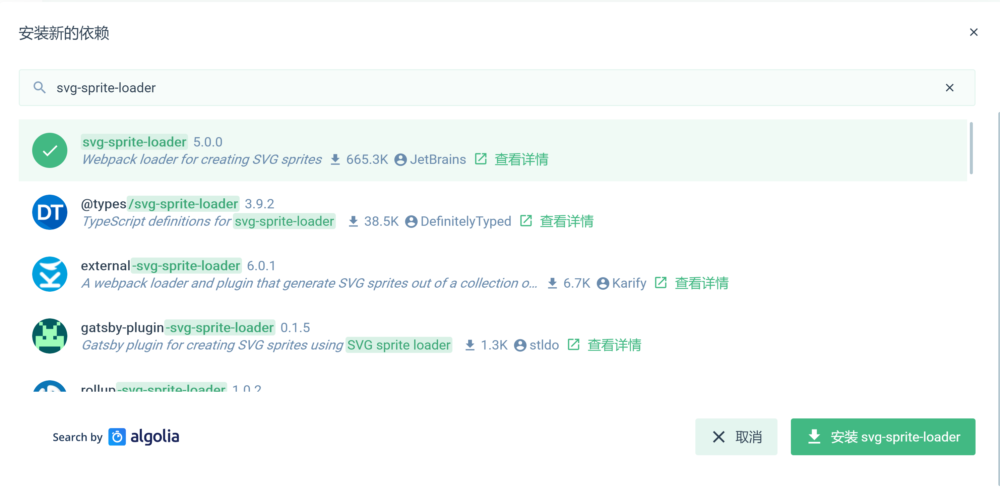
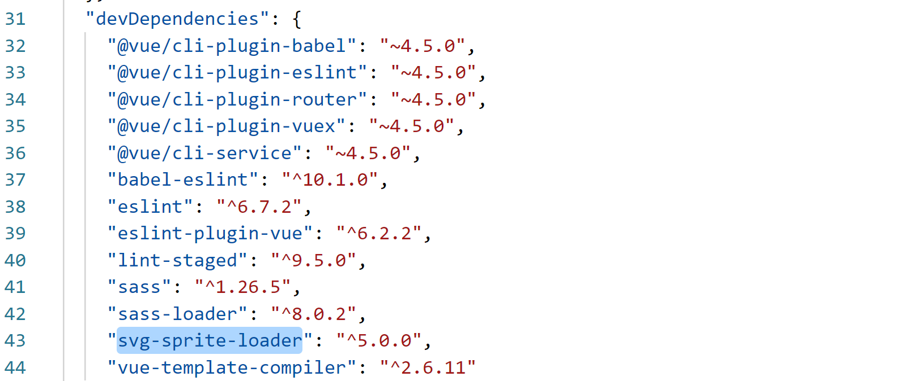
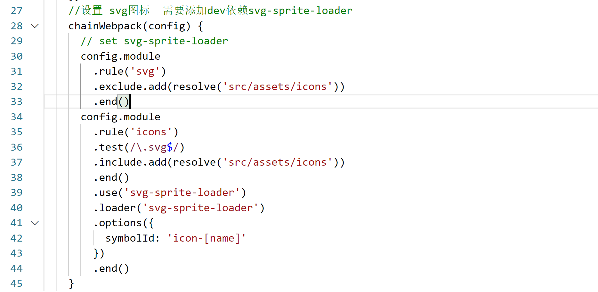
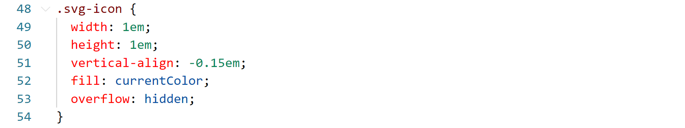
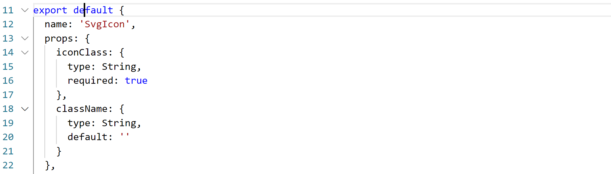
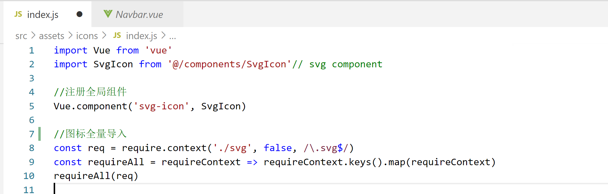
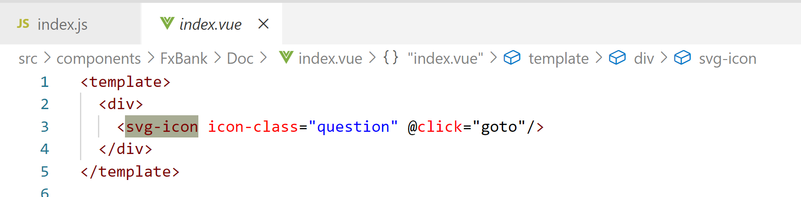

Vue-icon整合

Svg-icon的必要性
----------------

svg-icon
使用形式慢慢成为主流和推荐的方法。相关文章可以参考张鑫旭大大的文章[未来必热：SVG
Sprite技术介绍](http://www.zhangxinxu.com/wordpress/2014/07/introduce-svg-sprite-technology/?spm=a313x.7781069.1998910419.50)

-   支持多色图标了，不再受单色限制。

-   支持像字体那样通过font-size,color来调整样式。

-   支持 ie9+

-   可利用CSS实现动画。

-   减少HTTP请求。

-   矢量，缩放不失真

-   可以很精细的控制SVG图标的每一部分

安装svg插件依赖
---------------

在vue ui中选中项目安装svg-sprite-loader插件

该插件为开发依赖项

安装成功后查看package.json中存在依赖项svg

使用 svg-sprite
---------------

svg-sprite-loader 是webpack loader ，可以将多个 svg 打包成 svg-sprite。

在vue.config.js中设置webpack配置，处理svg

使用 webpack 的 exclude 和 include ，让svg-sprite-loader只处理你指定文件夹下面的
svg，url-loaer只处理除此文件夹之外的所以 svg，这样就完美解决了之前冲突的问题

新建svg-icon组件
----------------

在components下新建SvgIcon文件夹，名称匹配为svg-icon标签的驼峰名称匹配为SvgIcon

创建index.vue

加入通用的css代码（引入一次就行）

挑选相应图标并获取类名，应用于页面

\<svg class="icon" aria-hidden="true"\>

\<use xlink:href="\#icon-xxx"\>\</use\>

\</svg\>

导出组件

页面中使用

//引入svg组件

import IconSvg from '\@/components/IconSvg'

//全局注册icon-svg

Vue.component('icon-svg', IconSvg)

//在代码中使用

\<icon-svg icon-class="password" /\>

vue中全局使用icon
-----------------

### 加载全量icon

在assets文件夹下新建icons/svg存放svg矢量图

创建一个专门放置图标 icon 的文件夹如：\@/assets/icons/svg，将所有 icon
放在这个文件夹下。

Icons文件夹下，新建Index.js

导入SvgIcon，注册全局组件

使用 webpack 的 require.context加载

require.context有三个参数：

-   directory：说明需要检索的目录

-   useSubdirectories：是否检索子目录

-   regExp: 匹配文件的正则表达式

const req = require.context('./svg', false, /\\.svg\$/)

这行代码就会去 svg文件夹（不包含子目录）下面的找所有文件名以 .svg 结尾的文件能被
require 的文件。更直白的说就是 我们可以通过正则匹配引入相应的文件模块。

### 页面使用icon标签

直接在template中使用svg-icon组件

icon其他相关可查看
------------------

<https://juejin.im/post/6844903517564436493#heading-6>
