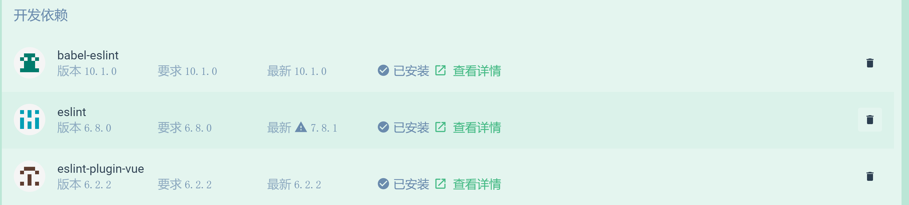
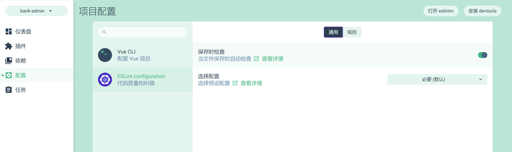
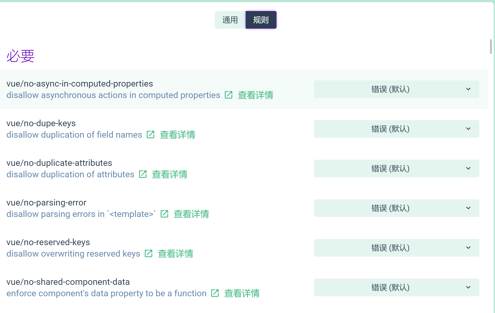
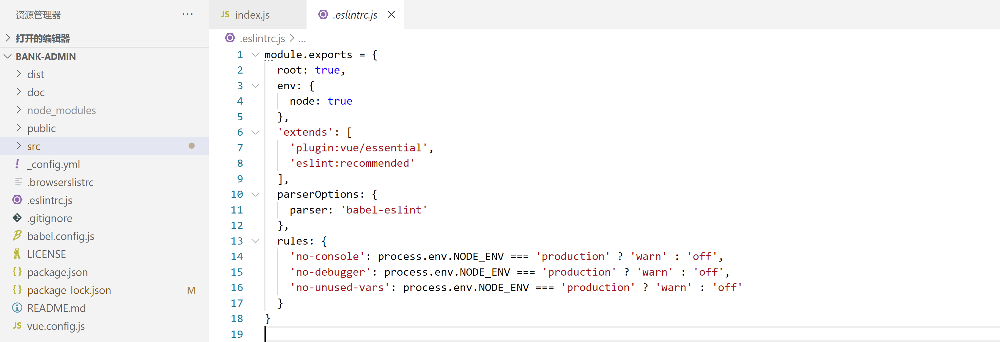

Vue-eslint整合

安装eslint插件依赖
------------------

在vue ui中选中项目安装eslint插件

安装成功后查看package.json中存在依赖项eslint

同样操作添加babel-eslint,eslint-plugin-vue开发依赖

配置eslint
----------

在项目配置中配置需要校验的项

在.eslintrc.js中查看相关配置

Rules为配置的规则
