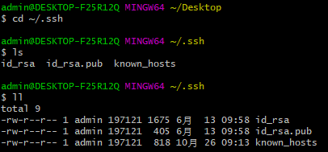
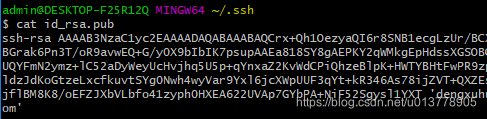
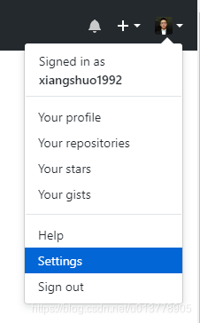
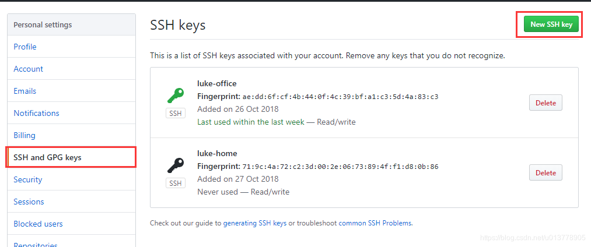
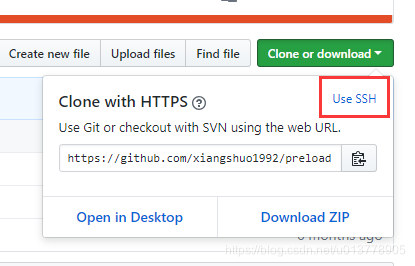
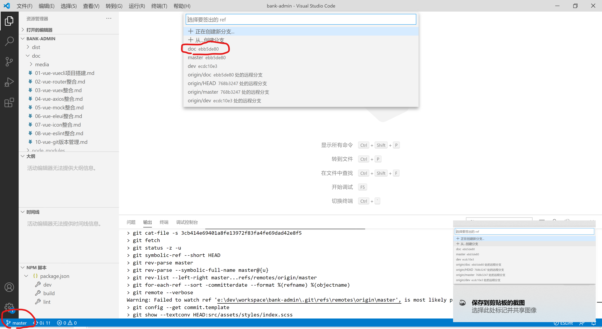
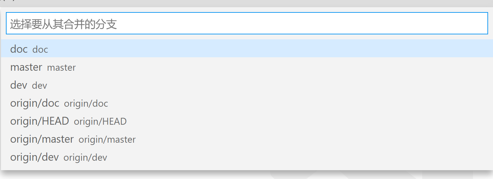

Vue-git版本管理

安装git
-------

参考相关文档

<https://www.liaoxuefeng.com/wiki/896043488029600/896067008724000>

生产自己的rsa公钥和密钥
-----------------------

命令行下执行 ssh-keygen -t rsa -C "你的email地址"

比如我的ssh-keygen -t rsa -C "1443585647\@qq.com"

下面就会有提示输入，公钥和私钥的存储位置和密码。直接回车

默认存储在/home/user/.ssh

目录下的:

公钥 : id_rsa.pub

私钥 : id_rsa

查看公钥内容

cat /home/zg/.ssh/id_rsa.pub

复制公钥内容到github个人设置中的SSH and GPG keys中的 New SSH key中。

测试与 github是否连接成功
-------------------------

运行命令 : ssh -T git\@github.com

显示结果 : Hi 1443585647! You’ve successfully authenticated, but GitHub does not
provide shell access. 代表成功。

Github相关配置参考
------------------

<https://blog.csdn.net/u013778905/article/details/83501204>

GitHub配置SSH
Key的目的是为了帮助我们在通过git提交代码是，不需要繁琐的验证过程，简化操作流程。

### 一、设置git的user name和email

如果你是第一次使用，或者还没有配置过的话需要操作一下命令，自行替换相应字段。

git config --global user.name "Luke.Deng"

git config --global user.email "xiangshuo1992\@gmail.com"

说明：git config --list 查看当前Git环境所有配置，还可以配置一些命令别名之类的。

### 二、检查是否存在SSH Key

cd \~/.ssh

ls

或者

ll

//看是否存在 id_rsa 和 id_rsa.pub文件，如果存在，说明已经有SSH Key

如下图  

  
如果没有SSH Key，则需要先生成一下

ssh-keygen -t rsa -C "xiangshuo1992\@gmail.com"

-   1

执行之后继续执行以下命令来获取SSH Key

cd \~/.ssh

ls

或者

ll

//看是否存在 id_rsa 和 id_rsa.pub文件，如果存在，说明已经有SSH Key

### 三、获取SSH Key

cat id_rsa.pub

//拷贝秘钥 ssh-rsa开头

如下图  

### 四、GitHub添加SSH Key

GitHub点击用户头像，选择setting  

新建一个SSH Key  

取个名字，把之前拷贝的秘钥复制进去，添加就好啦。

### 五、验证和修改

测试是否成功配置SSH Key

ssh -T git\@github.com

//运行结果出现类似如下

Hi xiangshuo1992! You've successfully authenticated, but GitHub does not provide
shell access.

之前已经是https的链接，现在想要用SSH提交怎么办？  
直接修改项目目录下 .git文件夹下的config文件，将地址修改一下就好了。

git地址获取可以看如下图切换。  

协同开发
--------

拉取master分支，并新建日期或者事项分支，如doc分支新增说明文档

点击左下角的master切换分支

切换至Doc分支新增文档完成后，提交代码

切换回master分支合并代码，选择从doc分支合并

